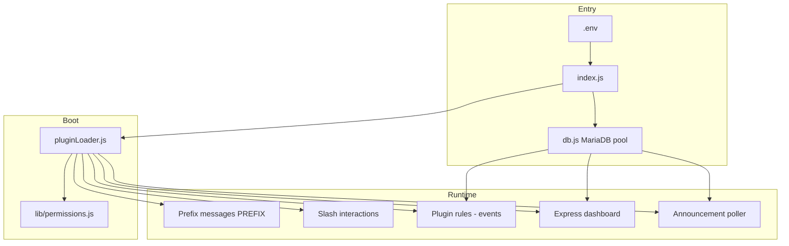

# Discord Master Bot v3.1

A modular Discord bot built with **discord.js v14**, **MariaDB**, and an optional **web dashboard**. Each feature lives in its own plugin file under `plugins/`. The bot supports both **prefix commands** (`!command`) and **global slash commands** (`/command`).

---

## Table of contents

1. [How the project works](#how-the-project-works)
2. [Project structure](#project-structure)
3. [Startup flow](#startup-flow)
4. [Plugin system](#plugin-system)
5. [Commands & help](#commands--help)
6. [Permissions](#permissions)
7. [Web dashboard](#web-dashboard)
8. [Database](#database)
9. [Plugins reference](#plugins-reference)
10. [Environment variables](#environment-variables)
11. [Setup & run](#setup--run)
12. [Adding a new plugin](#adding-a-new-plugin)
13. [Troubleshooting](#troubleshooting)

---

## How the project works



| Layer | Role |
|--------|------|
| **`index.js`** | Creates the Discord client, loads plugins, registers slash commands, routes `!` and `/` commands through a permission guard, and serves paginated `help`. |
| **`pluginLoader.js`** | Scans `plugins/*.js`, runs each plugin’s `init()`, registers `commands` on `client.commands`, attaches `rules` (event listeners), and fills `client.helpData`. |
| **`db.js`** | Shared MariaDB connection pool used by every plugin and the dashboard. |
| **`plugins/*.js`** | Self-contained features (music, leveling, tickets, etc.). |
| **`lib/`** | Shared logic: permissions, slash-command normalization, role logic engine, music queue, announcement checkers. |
| **`views/`** | EJS templates for the dashboard UI. |

`global.client` is set so the dashboard and background jobs (clock rename, announcement polling) can access the live bot instance.

---

## Project structure

```
discord/
├── index.js                 # Bot entry: client, help, command routing, slash sync
├── pluginLoader.js          # Auto-loads all plugins from plugins/
├── db.js                    # MariaDB pool + query helper
├── .env.example             # Required environment template
├── package.json
│
├── plugins/                 # One file = one plugin module
│   ├── dashboard.js         # Express admin UI + public leaderboard route
│   ├── music.js             # Voice music (play-dl + @discordjs/voice)
│   ├── lofi-radio.js        # HTTP internet radio stations
│   ├── announcements.js     # Stream + upload alerts (separate channels)
│   ├── role-logic.js        # Conditional auto-roles
│   ├── leveling.js          # XP, ranks, level roles
│   ├── welcome.js           # Welcome / goodbye / auto-roles
│   ├── warns.js             # Warning system + auto punishments
│   ├── moderation.js        # Kick, ban, timeout, slowmode
│   ├── tickets.js           # Support ticket panels
│   ├── starboard.js         # Star reaction mirror channel
│   ├── temp-channels.js     # Join-to-create voice channels
│   ├── reminders.js         # Personal reminders
│   ├── multipurpose.js      # Purge + reaction roles
│   ├── utility.js           # ping, serverinfo, poll, …
│   ├── fun.js / 8ball.js    # Small game commands
│   └── clock.js             # Live clock voice channel name
│
├── lib/
│   ├── permissions.js       # Per-guild command/plugin access levels
│   ├── slash.js             # Fills missing slash option descriptions on sync
│   ├── role-logic/engine.js
│   ├── music/               # resolver.js, queue.js
│   └── announcements/       # checkers, poller, templates, migrate
│
├── views/                   # Dashboard (EJS)
│   ├── index.ejs            # Main shell + sidebar panels
│   ├── login.ejs
│   ├── leaderboard.ejs
│   ├── sections/            # One partial per dashboard tab
│   └── partials/            # head, guild-script, discord-role-picker.js
│
└── Lavalink/                # Optional Lavalink config (not required for current music.js)
```

---

## Startup flow

1. **Environment** — `dotenv` loads `.env`. IPv4-friendly DNS flags are set for voice stability on some networks.
2. **Discord client** — Intents: guilds, messages, message content, members, voice, reactions.
3. **`loadPlugins(client, db)`** — For each `plugins/*.js`:
   - `await plugin.init(db)` — create tables, start intervals, mount Express (dashboard), etc.
   - Register each `command` in `client.commands` (name must be unique across all plugins).
   - Register `rules` as `client.on(event, …)`.
   - Store `help` text in `client.helpData`.
4. **`initPermissions(db)`** — Creates `command_permissions` and caches guild overrides.
5. **Event handlers** in `index.js`:
   - **Buttons** — Paginated `help` (only the user who ran help can flip pages).
   - **Slash** — `guardCommand` → `cmd.execute(ctx, db, true)`.
   - **Messages** — Prefix parse → `guardCommand` → `cmd.execute(ctx, db, false, args)`.
6. **`ClientReady`** — Sync all slash commands to Discord via REST (`buildSlashCommandPayload` ensures every option has a `description`).

---

## Plugin system

Every plugin exports a default object:

```js
export default {
    name: 'Display Name',           // Shown in help overview
    help: [                         // Optional: { usage, description } for !help pages
        { usage: '`!foo`', description: '…' },
    ],
    init: async (db) => { … },      // Optional: tables, timers, HTTP server
    commands: [                     // Optional: registered by command name
        {
            name: 'foo',            // Must be snake_case for slash (no hyphens)
            description: '…',       // Slash command description (required)
            options: [ … ],         // Slash options; description required by Discord
            async execute(ctx, db, isSlash, args) { … },
        },
    ],
    rules: [                        // Optional: Discord events
        { name: '…', event: 'messageCreate', async execute(…, db) { … } },
    ],
};
```

### `execute(ctx, db, isSlash, args)` contract

| Parameter | Prefix (`!`) | Slash (`/`) |
|-----------|----------------|-------------|
| `ctx` | `Message` | `ChatInputCommandInteraction` |
| `db` | `query(sql, params)` | same |
| `isSlash` | `false` | `true` |
| `args` | string array after command name | use `ctx.options.get*` instead |

**Tips**

- Slash deferrals: use `ctx.deferReply()` then `ctx.editReply()` for slow commands (e.g. music search).
- Reply on slash: `ctx.reply({ ephemeral: true })` for errors only you should see.
- Command names are global — two plugins cannot both define `play` unless one is removed.

---

## Commands & help

| Style | Example |
|--------|---------|
| Prefix | `!rank`, `!play never gonna give you up` |
| Slash | `/rank`, `/play query:…` |
| Help | `!help` or `/help` — paginated embeds per plugin |

Default prefix: `!` (`PREFIX` in `.env`).

On startup, all plugin commands are registered as **global** application commands. Discord can take up to an hour to propagate globally; during development you may use guild-specific commands if you add that to `index.js`.

---

## Permissions

Configured in the dashboard under **Permissions** (or stored in `command_permissions`).

| Level | Who can run |
|--------|-------------|
| `everyone` | Anyone in the server |
| `member` | Users with at least one role besides `@everyone` |
| `admin` | Manage Server or Administrator |

**Admins bypass all checks.** Command-level rules override plugin-level rules.

Enforcement happens in `index.js` via `guardCommand()` before every prefix and slash execution.

---

## Web dashboard

- **URL:** `http://localhost:DASHBOARD_PORT` (default `3000`)
- **Login:** Password from `DASHBOARD_PASSWORD` (signed cookie via `SESSION_SECRET`)
- **Requires:** Bot online (`global.client`) for live guild/channel/role dropdowns

### Dashboard panels

| Panel | What you configure |
|--------|---------------------|
| Overview | Stats, system load, plugin list |
| Role Logic | AND/OR/NOT rules, reward roles |
| Leveling | XP settings, level roles, boosts |
| Welcome | Welcome/goodbye messages, auto-roles |
| Starboard | Channel + star threshold |
| Announcements | **Separate** stream vs upload channels, creators |
| Warnings | Auto-mute/kick/ban thresholds |
| Tickets | Panel, staff role, category |
| Temp VC | Join-to-create voice setup |
| Radios | Per-guild lofi station preference |
| Clock | Voice channel live clock + timezone |
| Permissions | Per-plugin / per-command access |
| Theme | Global dashboard accent color |

Public page: `GET /leaderboard/:guildId` — XP leaderboard (no login).

---

## Database

**Engine:** MariaDB (MySQL-compatible)

Each plugin creates its own tables in `init()`. There is no single migration runner — schema evolves via `CREATE TABLE IF NOT EXISTS` and occasional `ALTER TABLE` in plugin code (e.g. `announce_settings` migration in `lib/announcements/migrate.js`).

Core shared tables:

| Table | Used by |
|--------|---------|
| `command_permissions` | Permission system |
| `bot_settings` | Dashboard theme (`GLOBAL` accent) |

All other tables are plugin-specific (`levels`, `role_logic`, `announce_subscriptions`, `tickets`, etc.).

---

## Plugins reference

### Music (`music.js`)

- Voice playback via **play-dl** + **@discordjs/voice** + **ffmpeg-static**
- Sources: YouTube, SoundCloud URLs; search by text; Spotify links if `SPOTIFY_CLIENT_ID` / `SECRET` are set
- Commands: `play`, `queue`, `skip`, `stop`, `pause`, `resume`, `nowplaying`, `shuffle`, `remove`, `volume`, `leave`

### Lofi radio (`lofi-radio.js`)

- Streams public HTTP radio URLs (no YouTube) — good for restricted networks
- Commands: `lofi`, `lofi_stop`, `lofi_list` (and slash variants)

### Stream & social announcements (`announcements.js`)

- **Stream channel** — Twitch / Kick / YouTube live (Dyno/Sapphire-style split)
- **Upload channel** — YouTube new videos only
- Background poller (~2 min, `ANNOUNCE_POLL_MS`)
- Twitch requires `TWITCH_CLIENT_ID` + `TWITCH_CLIENT_SECRET`
- Commands: `stream_setup`, `upload_setup`, `announce_add`, `announce_remove`, `announce_list`, `announce_disable`

### Role logic (`role-logic.js`)

- Rules: required roles (AND), optional pool (OR + `min_optional`), forbidden (NOT), priority, enable/disable
- Runs on `guildMemberUpdate` and `guildMemberAdd`; manual `sync_roles`
- Engine: `lib/role-logic/engine.js`

### Leveling (`leveling.js`)

- XP from messages; level-up announcements; level roles; role XP boosts; ignores
- Web leaderboard via dashboard route
- Commands: `rank`, `levels`, `level_role`, `level_config`, `xp_*`, etc.

### Welcome (`welcome.js`)

- Welcome/goodbye channels with `{user}`, `{server}`, `{membercount}`
- Multiple auto-roles on join

### Warnings (`warns.js`)

- Warn users; thresholds trigger mute/kick/ban; log channel option

### Moderation (`moderation.js`)

- `kick`, `ban`, `unban`, `timeout`, `untimeout`, `slowmode`

### Tickets (`tickets.js`)

- Button panel → private ticket channels; claim, close, add/remove users

### Starboard (`starboard.js`)

- Mirrors messages that reach ⭐ threshold to a dedicated channel

### Temp channels (`temp-channels.js`)

- “Create channel” voice hub → personal temporary VCs; rename, limit, transfer, kick

### Reminders (`reminders.js`)

- `remind 30m message`, list/cancel by ID

### Multipurpose (`multipurpose.js`)

- `purge` (bulk delete), reaction roles (`add_rr`, `remove_rr`, `list_rr`)

### Utility (`utility.js`)

- `ping`, `serverinfo`, `userinfo`, `avatar`, `poll`

### Fun / 8-Ball (`fun.js`, `8ball.js`)

- `coinflip`, `roll`, `choose`; magic 8-ball with embed

### Clock (`clock.js`)

- Renames a voice channel every minute to show live time in a timezone

### Dashboard (`dashboard.js`)

- No bot commands; starts Express and handles form POSTs for all configured features

---

## Environment variables

Copy `.env.example` to `.env`:

| Variable | Required | Purpose |
|----------|----------|---------|
| `DISCORD_TOKEN` | Yes | Bot token from [Discord Developer Portal](https://discord.com/developers/applications) |
| `PREFIX` | No | Default `!` |
| `DB_HOST`, `DB_USER`, `DB_PASS`, `DB_NAME` | Yes | MariaDB connection |
| `DASHBOARD_PORT` | No | Default `3000` |
| `DASHBOARD_PASSWORD` | Yes* | Dashboard login (*change from default) |
| `SESSION_SECRET` | Yes* | Signs session cookies |
| `TWITCH_CLIENT_ID`, `TWITCH_CLIENT_SECRET` | For Twitch live alerts | [Twitch Dev Console](https://dev.twitch.tv/console/apps) |
| `ANNOUNCE_POLL_MS` | No | Announcement poll interval (default `120000`) |
| `SPOTIFY_CLIENT_ID`, `SPOTIFY_CLIENT_SECRET` | No | Resolve Spotify URLs in music |

### Bot intents (Developer Portal)

Enable: **Server Members Intent**, **Message Content Intent** (for prefix commands and XP).

---

## Setup & run

### Prerequisites

- Node.js 18+
- MariaDB server and database created
- ffmpeg available (bundled via `ffmpeg-static` for music)

### Install

```bash
cp .env.example .env
# Edit .env with token, database, dashboard password, secrets

npm install
```

### Run

```bash
npm run dev      # Development with --watch
npm start        # Production
npm run start:prod
```

### First-time checklist

1. Invite bot with permissions: Manage Roles, Manage Channels, Send Messages, Connect/Speak (voice), Moderate Members (moderation/warns).
2. Start bot → console should show `✅ Loaded: …` for each plugin and `📡 Global Slash Commands Synchronized.`
3. Open dashboard → log in → configure stream/upload channels, leveling, etc.
4. In Discord: `!help` or `/help` to see commands.

---

## Adding a new plugin

1. Create `plugins/my-feature.js` with the plugin object shape above.
2. Use `snake_case` command names and **descriptions on every slash option** (or rely on `lib/slash.js` auto-fill at sync time).
3. Create tables in `init(db)` with `CREATE TABLE IF NOT EXISTS`.
4. Restart the bot — `pluginLoader` picks up the file automatically.
5. Optionally add a dashboard section in `views/sections/` and routes in `plugins/dashboard.js`.

---

## Troubleshooting

### Slash sync error: `options[n].description[BASE_TYPE_REQUIRED]`

Discord requires a description on every slash option. The bot auto-fills missing ones in `lib/slash.js` during sync. If you still see errors, restart after pulling latest `index.js` and ensure `buildSlashCommandPayload` is used.

### Dashboard guild dropdowns empty

Bot must be **online**. `buildClientGuilds()` reads `client.guilds.cache`. Check `clientReady` banner on the dashboard.

### Music not playing

- Bot and user must be in a **voice channel**.
- Ensure ffmpeg is on PATH or `ffmpeg-static` installed.
- For Spotify links, set Spotify API credentials in `.env`.

### Twitch announcements not posting

Set `TWITCH_CLIENT_ID` and `TWITCH_CLIENT_SECRET`. Kick and YouTube live/upload use other APIs/RSS and do not need Twitch keys.

### Announcements fire for old videos on add

Creators are **seeded** on add so the first poll does not spam old content. If you still see a one-off, the channel may have been added before seeding existed.

### Command not found

- Check exact name (`stream_setup` not `stream-setup`).
- Slash commands can take time to update globally.
- Another plugin may not register duplicate names.

### MariaDB connection errors

Verify `DB_*` values, database exists, user has grants, and MariaDB is reachable from the host running the bot.

---

## Version notes (v3.x)

- **Modular plugins** — drop-in files under `plugins/`
- **Paginated help** with button navigation
- **Permission system** — dashboard + enforcement
- **Advanced role logic** — AND / OR / NOT with priority
- **Split announcements** — stream channel vs upload channel
- **Dashboard UI** — EJS sections, Discord-style role picker
- **Slash sync helper** — `lib/slash.js` normalizes command payloads
- Command names use **`snake_case`** (Discord disallows hyphens in slash names)

---

## Quick command index

Use `!help` in Discord for the full list. Common entry points:

| Area | Commands |
|------|-----------|
| Help | `!help` / `/help` |
| Music | `!play`, `!queue`, `!skip` |
| Radio | `!lofi`, `!lofi_stop` |
| Streams | `!stream_setup`, `!upload_setup`, `!announce_add` |
| Levels | `!rank`, `!levels` |
| Roles | `!add_logic`, `!list_logic`, `!sync_roles` |
| Mod | `!warn`, `!kick`, `!ban`, `!timeout` |
| Tickets | `!ticket_setup` |
| Utility | `!ping`, `!serverinfo`, `!purge` |

---

*Discord Master Bot — modular core, MariaDB persistence, web dashboard for server admins.*
